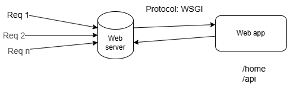
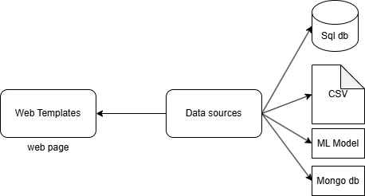

#### Flask framework

1. WSAI : Web Server GetWay Interface
2. Jinja 2 : Template Engine

Flask: web framework which is created with the python programming language

Web server:

1. AWS EC2
2. Azure app
3. Apache

**Jinja 2 Template Engine**

+ jinja 2 : Web template engine
+ 